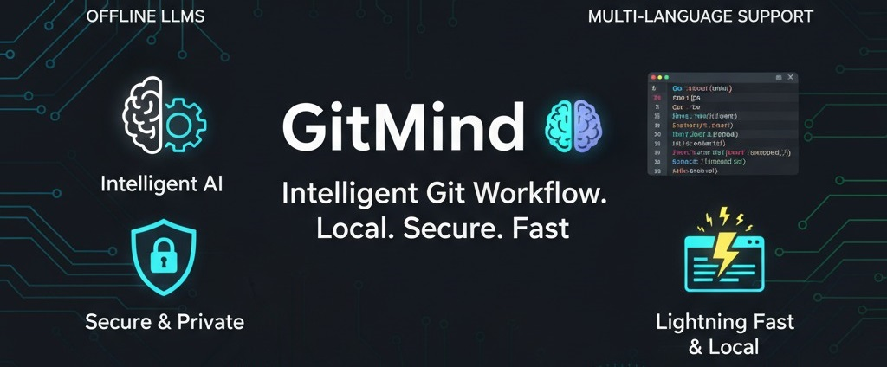

# GitMind 🧠

**Intelligent Git Commit Message Generator with Multi-Language Security Analysis**

GitMind is a powerful Go-based CLI tool that revolutionizes your Git workflow by providing AI-powered commit message generation, comprehensive multi-language security analysis, automated test generation, and intelligent multi-commit splitting. Works entirely offline with local LLMs for maximum privacy and performance.



## ✨ Key Features

- 🤖 **Smart Commit Message Generation** - AI-powered messages using local LLMs (Ollama)
- 🔒 **Multi-Language Security Analysis** - Support for 10+ languages with comprehensive analyzers:
  - **Go**: gosec for security vulnerabilities
  - **Python**: bandit + safety for code & dependency security
  - **JavaScript/TypeScript**: eslint-security for web vulnerabilities
  - **Ruby**: brakeman for Rails security issues
  - **Java**: spotbugs for comprehensive bug detection
  - **PHP**: psalm + phpstan for type safety & security
  - **C/C++**: cppcheck + flawfinder for memory safety
  - **Rust**: cargo-audit + clippy for safety & best practices
  - **Multi-language**: semgrep for OWASP Top 10 & custom rules
- 🧪 **Automated Test Generation** - Generate skeleton unit tests for changed functions
- 🔄 **Multi-Commit Splitting** - Intelligently split large commits into focused, atomic changes
- ⚡ **Lightning Fast** - Local processing with sub-second response times
- 🔐 **Privacy First** - Your code never leaves your machine
- 🎯 **Git Hook Integration** - Seamless integration with your existing Git workflow
- 📝 **Configurable Styles** - Conventional Commits, custom templates, and more
- 🛡️ **Heuristic Fallback** - Works even without LLM configuration
- 🛠️ **Enhanced Multi-Commit** - Fixed git stash issues with robust fallback mechanisms

---

## 🆕 What's New in v1.2

### 💪 Enhanced Multi-Language Security Analysis
- **10+ Languages Supported**: Go, Python, JavaScript/TypeScript, Ruby, Java, PHP, C/C++, Rust
- **14 Security Analyzers**: gosec, bandit, safety, eslint-security, brakeman, spotbugs, psalm, phpstan, cppcheck, flawfinder, cargo-audit, clippy, semgrep, securecodewarrior
- **Advanced Pattern Detection**: OWASP Top 10, hardcoded secrets, SQL injection, XSS, buffer overflows
- **Configurable Blocking**: Option to block commits on high-severity issues
- **Smart Commit Integration**: Security notes automatically added to commit messages

### 🛠️ Robust Multi-Commit Splitting
- **Fixed Git Stash Issues**: Resolved exit status 129 errors with binary files and file conflicts
- **Dual Fallback Strategy**: Primary git stash with automatic temporary commit fallback
- **Enhanced File Handling**: Proper support for deleted files, binary files, and renames
- **Error Recovery**: Automatic staging area restoration on commit failures
- **Git Notes Integration**: Metadata tracking for reliable state restoration

### 📖 Comprehensive Command Options
- **Hidden Flags Documented**: All `--block`, `--verbose`, `--interactive`, `--stage`, `--output` options
- **Boolean Flag Support**: Explicit true/false syntax for all commands
- **Flexible Configuration**: Override config settings via command-line flags
- **Exit Code Standardization**: Proper exit codes for CI/CD integration

### 📊 Improved Configuration
- **Multi-Analyzer Support**: Configure multiple security analyzers per language
- **Granular Control**: Enable/disable specific analyzers based on project needs
- **Team-Friendly Defaults**: Optimized configurations for different team sizes
- **Enterprise Security**: High-security configuration templates

### 🔧 Developer Experience
- **Better Error Messages**: Clear explanations when analyzers are missing
- **Installation Guides**: Step-by-step setup for all security analyzers
- **Real-World Examples**: Comprehensive usage scenarios and workflows
- **Performance Optimizations**: Faster analysis with concurrent analyzer execution

---

## 📋 Table of Contents

- [What's New in v1.2](#whats-new-in-v11)
- [Quick Start](#quick-start)
- [Detailed Installation](#detailed-installation)
  - [Prerequisites](#prerequisites)
  - [Method 1: Binary Release](#method-1-binary-release-recommended)
  - [Method 2: Build from Source](#method-2-build-from-source)
  - [Method 2a: Build Using Makefile](#method-2a-build-using-makefile-recommended-for-development)
  - [Method 4: Go Install](#method-4-go-install)
- [LLM Setup](#llm-setup)
  - [Ollama Setup (Recommended)](#ollama-setup-recommended)
- [Configuration](#configuration)
- [Usage Guide](#usage-guide)
  - [Basic Usage](#basic-usage)
  - [Advanced Features](#advanced-features)
  - [Real-World Scenarios](#real-world-scenarios)
- [Command Reference](#command-reference)
- [Multi-Language Security Analysis](#multi-language-security-analysis)
- [Troubleshooting](#troubleshooting)
- [FAQ](#frequently-asked-questions)
- [Contributing](#contributing)

---

## 🚀 Quick Start

**Get up and running in 5 minutes:**

```bash
# 1. Download and install Ollama (for local LLM support)
curl -fsSL https://ollama.ai/install.sh | sh

# 2. Pull a coding model
ollama pull qwen2.5-coder:3b

# 3. Clone and build GitMind
git clone https://github.com/Harri200191/gitmind.git
cd gitmind

# Option A: Using Makefile (recommended)
make all  # Builds for Linux, Windows, and creates .deb packages

# Option B: Direct Go build
go build -o gitmind ./cmd/gitmind

# 4. Install the Git hook in your project
./gitmind install-hook

# 5. Copy and configure
cp configs/.gitmind.example .gitmind.yaml
# Edit model_path to "qwen2.5-coder:3b"

# 6. Test it out!
echo "// TODO: implement feature" > test.go
git add test.go
git commit  # GitMind generates the message!
```

---

## 📦 Detailed Installation

### Prerequisites

**System Requirements:**
- **OS**: Windows 10+, macOS 10.15+, Linux (Ubuntu 18.04+, CentOS 7+)
- **RAM**: 8GB+ recommended (4GB minimum for small models)
- **Storage**: 2-10GB for models (depending on size)
- **Git**: Version 2.10 or higher

**Development Tools:**
- **Go**: Version 1.19 or higher (for building from source)
- **C Compiler**: GCC, Clang, or MSVC (for llama.cpp bindings)

### Method 1: Binary Release (Recommended)

**Download pre-built binaries for your platform:**

```bash
# Linux x64
wget https://github.com/Harri200191/gitmind/releases/latest/download/gitmind-linux-amd64.tar.gz
tar -xzf gitmind-linux-amd64.tar.gz
sudo mv gitmind /usr/local/bin/

# macOS (Intel)
wget https://github.com/Harri200191/gitmind/releases/latest/download/gitmind-darwin-amd64.tar.gz
tar -xzf gitmind-darwin-amd64.tar.gz
sudo mv gitmind /usr/local/bin/

# macOS (Apple Silicon)
wget https://github.com/Harri200191/gitmind/releases/latest/download/gitmind-darwin-arm64.tar.gz
tar -xzf gitmind-darwin-arm64.tar.gz
sudo mv gitmind /usr/local/bin/

# Windows
# Download gitmind-windows-amd64.zip from releases
# Extract to C:\Program Files\gitmind\ or add to PATH
```

**Verify installation:**
```bash
gitmind version
# Should output: gitmind <version>
```

### Method 2: Build from Source

**For developers who want the latest features:**

```bash
# 1. Install prerequisites
## Ubuntu/Debian
sudo apt update
sudo apt install build-essential cmake git

## CentOS/RHEL
sudo yum groupinstall "Development Tools"
sudo yum install cmake git

## macOS
brew install cmake git
# Install Xcode command line tools
xcode-select --install

## Windows
# Install Visual Studio 2019+ with C++ tools
# Install Git for Windows
# Install Go from https://golang.org/dl/

# 2. Clone repository
git clone https://github.com/Harri200191/gitmind.git
cd gitmind

# 3. Build
go mod tidy
go build -o gitmind ./cmd/gitmind

# 4. Optional: Install globally
sudo cp gitmind /usr/local/bin/  # Linux/macOS
# or add to PATH on Windows

# 5. Verify
./gitmind version
```

### Method 2a: Build Using Makefile (Recommended for Development)

**GitMind includes a comprehensive Makefile for various build scenarios:**

```bash
# 1. Install prerequisites (same as Method 2)
## Ubuntu/Debian
sudo apt update
sudo apt install build-essential cmake git make

## CentOS/RHEL
sudo yum groupinstall "Development Tools"
sudo yum install cmake git make

## macOS
brew install cmake git make
xcode-select --install

# 2. Clone repository
git clone https://github.com/Harri200191/gitmind.git
cd gitmind

# 3. Build options:

## Build all targets (Linux, Windows, and .deb packages)
make all
# Creates:
# - bin/gitmind (Linux)
# - bin/gitmind.exe (Windows)
# - bin/gitmind_amd64.deb
# - bin/gitmind_arm.deb
# - bin/gitmind_arm64.deb

## Build just Linux binary
make bin/gitmind

## Build just Windows binary
make bin/gitmind.exe

## Build Debian packages for all architectures
make deb-packages

## Build for specific architecture
make bin/gitmind-bin_amd64  # 64-bit Intel/AMD
make bin/gitmind-bin_arm    # 32-bit ARM
make bin/gitmind-bin_arm64  # 64-bit ARM (Apple Silicon, etc.)

## Clean build artifacts
make clean

# 4. Install globally
sudo cp bin/gitmind /usr/local/bin/  # Linux/macOS
# or add to PATH on Windows

# 5. Verify
gitmind version
```

**Available Makefile Targets:**

| Target | Description | Output |
|--------|-------------|--------|
| `make all` | Build everything | Linux binary, Windows binary, .deb packages |
| `make bin/gitmind` | Linux 64-bit binary | `bin/gitmind` |
| `make bin/gitmind.exe` | Windows 64-bit binary | `bin/gitmind.exe` |
| `make deb-packages` | Debian packages for all archs | `bin/gitmind_*.deb` |
| `make bin/gitmind-bin_amd64` | Linux amd64 binary | `bin/gitmind-bin_amd64` |
| `make bin/gitmind-bin_arm` | Linux ARM binary | `bin/gitmind-bin_arm` |
| `make bin/gitmind-bin_arm64` | Linux ARM64 binary | `bin/gitmind-bin_arm64` |
| `make clean` | Remove build artifacts | Cleans `bin/` and `debuild/` |

**Debian Package Installation:**
```bash
# Build .deb package
make deb-packages

# Install on Debian/Ubuntu
sudo dpkg -i bin/gitmind_amd64.deb

# Fix dependencies if needed
sudo apt-get install -f

# Verify installation
gitmind version
which gitmind  # Should show /usr/bin/gitmind
```

### Method 4: Go Install

**Quick installation for Go developers:**

```bash
go install github.com/Harri200191/gitmind/cmd/gitmind@latest
# Ensure $GOPATH/bin is in your PATH
gitmind version
```

---

## 🤖 LLM Setup

GitMind supports multiple LLM providers. Choose the one that best fits your needs:

### Ollama Setup (Recommended)

**Ollama provides the easiest local LLM experience:**

```bash
# 1. Install Ollama
## Linux/macOS
curl -fsSL https://ollama.ai/install.sh | sh

## Windows
# Download from https://ollama.ai/download/windows

# 2. Start Ollama service
ollama serve  # Runs in background

# 3. Pull recommended models
## For commit messages (lightweight, fast)
ollama pull qwen2.5-coder:3b        # 2GB, very fast
ollama pull codellama:7b             # 4GB, good quality
ollama pull deepseek-coder:6.7b      # 4GB, excellent for code

## For comprehensive analysis (higher quality)
ollama pull qwen2.5-coder:14b       # 8GB, best quality
ollama pull codellama:13b            # 7GB, very good

# 4. Test model
ollama run qwen2.5-coder:3b "Write a git commit message for adding a new feature"
```

**Model Recommendations by Use Case:**

| Use Case | Model | Size | Speed | Quality |
|----------|-------|------|-------|----------|
| **Quick commits** | qwen2.5-coder:3b | 2GB | ⚡⚡⚡ | ⭐⭐⭐ |
| **Balanced** | codellama:7b | 4GB | ⚡⚡ | ⭐⭐⭐⭐ |
| **Best quality** | qwen2.5-coder:14b | 8GB | ⚡ | ⭐⭐⭐⭐⭐ |
| **Code-specific** | deepseek-coder:6.7b | 4GB | ⚡⚡ | ⭐⭐⭐⭐ |


---

## ⚙️ Configuration

**GitMind uses a `.gitmind.yaml` configuration file with comprehensive options:**

### Configuration Locations

GitMind looks for configuration in this order:
1. `.gitmind.yaml` in current Git repository root
2. `~/.gitmind.yaml` in user home directory
3. Default built-in configuration

### Complete Configuration Example

```yaml
# Basic settings
style: conventional  # conventional | plain | custom
max_summary_lines: 15

# LLM Configuration
model:
  enabled: true
  provider: ollama              # ollama | llama.cpp
  model_path: "qwen2.5-coder:3b"  # Ollama model name or file path
  n_ctx: 8192                   # Context window size
  n_threads: 6                  # CPU threads (auto-detected if 0)
  temperature: 0.2              # Creativity (0.0-2.0)
  top_p: 0.9                    # Nucleus sampling
  max_tokens: 256               # Maximum response length

# Custom prompts
prompt:
  preface: |
    You are an expert Git commit message writer.
    Analyze the code diff and create a clear, concise commit message.
    Focus on what changed and why, not just the technical details.
  rules: |
    - Use imperative mood ("add", "fix", "update")
    - Keep subject line ≤ 72 characters
    - Add body for complex changes
    - Use conventional commit format when possible
    - Be specific about the impact of changes

# Multi-commit splitting
multi_commit:
  enabled: true                 # Enable intelligent commit splitting
  max_clusters: 3               # Maximum commits to create
  similarity_threshold: 0.7     # How similar changes should be grouped
  prompt_user: true             # Ask for confirmation before splitting

# Test generation
test_generation:
  enabled: true                 # Generate tests for changed functions
  frameworks: ["testing", "testify", "ginkgo"]  # Testing frameworks
  output_dir: "."               # Where to place test files
  auto_stage: false             # Automatically stage generated tests

# Security analysis
security:
  enabled: true                 # Enable security scanning
  analyzers:
    # Language-specific analyzers
    - "gosec"                   # Go security
    - "bandit"                  # Python security
    - "eslint-security"         # JavaScript/TypeScript
    - "brakeman"                # Ruby on Rails
    - "safety"                  # Python dependencies
    - "cargo-audit"             # Rust dependencies
    - "semgrep"                 # Multi-language patterns
  block_on_high: false          # Block commits with high-severity issues
  include_in_msg: true          # Add security notes to commit messages
```

### Quick Configuration Templates

**Minimal (Ollama):**
```yaml
model:
  enabled: true
  provider: ollama
  model_path: "qwen2.5-coder:3b"
```

**Development Team:**
```yaml
style: conventional
model:
  enabled: true
  provider: ollama
  model_path: "codellama:7b"
security:
  enabled: true
  analyzers: ["gosec", "bandit", "eslint-security", "semgrep"]
  block_on_high: true
  include_in_msg: false
multi_commit:
  enabled: true
  max_clusters: 3
test_generation:
  enabled: true
  auto_stage: true
  output_dir: "tests/"
```

**Enterprise (High Security):**
```yaml
style: conventional
model:
  enabled: true
  provider: ollama
  model_path: "qwen2.5-coder:14b"
  temperature: 0.1
security:
  enabled: true
  # Comprehensive multi-language analyzer suite
  analyzers: [
    "gosec",           # Go security
    "bandit",          # Python security
    "safety",          # Python dependencies
    "eslint-security",  # JavaScript/TypeScript
    "brakeman",        # Ruby on Rails
    "spotbugs",        # Java
    "psalm",           # PHP static analysis
    "phpstan",         # PHP type checking
    "cppcheck",        # C/C++ static analysis
    "flawfinder",      # C/C++ security
    "cargo-audit",     # Rust dependencies
    "clippy",          # Rust best practices
    "semgrep",         # Multi-language patterns
    "securecodewarrior" # Enterprise patterns
  ]
  block_on_high: true
  include_in_msg: true
multi_commit:
  enabled: true
  prompt_user: true
  max_clusters: 5
  similarity_threshold: 0.8
test_generation:
  enabled: true
  frameworks: ["testing", "testify"]
  auto_stage: false
```

---

## 📖 Usage Guide

### Basic Usage

**1. Install Git Hook**
```bash
# In your Git repository
gitmind install-hook
# Output: Installed prepare-commit-msg hook.

# Verify installation
ls -la .git/hooks/prepare-commit-msg
# Should show the hook file
```

**2. Normal Git Workflow**
```bash
# Make changes
echo "package main\n\nfunc main() { println(\"Hello World\") }" > main.go

# Stage changes
git add main.go

# Commit (GitMind generates message automatically)
git commit
# Your editor opens with a generated message like:
# "add initial Go main function
# 
# → implement basic hello world program
# → set up project entry point"

# Edit if needed, save and close
```

**3. Manual Message Generation**
```bash
# Generate without committing
git add .
gitmind generate -f commit_msg.txt
cat commit_msg.txt

# Use in commit
git commit -F commit_msg.txt
```

### Advanced Features

**1. Multi-Language Security Analysis**
```bash
# Run security check on staged changes
gitmind security-check

# Output:
# 🔒 Security Analysis Results:
#   Total findings: 2
#   High severity: 0
#   Medium severity: 1
#   Low severity: 1
# 
# Detailed Findings:
#   🟡 [medium] main.py:15 - Hardcoded password detected
#     💡 Use environment variables or secure configuration
#   🟢 [low] server.go:23 - HTTP instead of HTTPS
#     💡 Use HTTPS for secure communication

# Verbose output
gitmind security-check --verbose

# Block commits on high-severity issues
gitmind security-check --block
```

**2. Multi-Commit Splitting**
```bash
# When you have multiple logical changes staged
git add .
gitmind multi-commit

# Output:
# 💡 Detected 3 logical changes:
# 1. Add user authentication (auth.go, login.go)
# 2. Update database schema (migrations/001_users.sql)
# 3. Fix typo in documentation (README.md)
# 
# Split into separate commits? [y/N]: y
# 
# ✅ Created 3 commits:
# - feat: add user authentication system
# - db: update schema for user management
# - docs: fix typo in installation instructions

# Interactive mode for fine-tuning
gitmind multi-commit --interactive
```

**🛠️ Multi-Commit Improvements (v1.2+):**
GitMind now includes enhanced multi-commit functionality with robust error handling:

- **Fixed Git Stash Issues**: Resolved exit status 129 errors when dealing with binary files, missing files, or conflicts between staging area and working directory
- **Dual Fallback Strategy**: 
  - Primary: Uses `git stash push --staged` for clean operations
  - Fallback: Creates temporary commits with git notes metadata when stash fails
- **Enhanced File Handling**: Properly handles deleted files, binary files, and file renames
- **Improved Error Recovery**: Automatic restoration of staging area if any commit fails
- **Better Conflict Resolution**: Graceful handling of files that exist in staging but not working directory

```bash
# The multi-commit process is now more robust:
git add .
gitmind multi-commit

# If stash fails, GitMind automatically:
# 1. Creates a temporary commit to save staged changes
# 2. Uses git notes to track the temporary commit
# 3. Restores changes via cherry-pick when needed
# 4. Cleans up temporary metadata automatically
```

**3. Test Generation**
```bash
# Generate tests for changed functions
gitmind suggest-tests

# Output:
# 🔍 Found 3 functions that can be tested:
#   - main.CalculateSum
#   - utils.ValidateEmail
#   - auth.HashPassword
# 
# ✅ Generated test files:
#   - main_test.go
#   - utils_test.go
#   - auth_test.go

# Auto-stage generated tests
gitmind suggest-tests --stage

# Custom output directory
gitmind suggest-tests --output tests/
```

**4. Configuration Validation**
```bash
# Check if LLM is working
gitmind doctor

# Output:
# ✅ Configuration: Found .gitmind.yaml
# ✅ LLM Provider: Ollama running on localhost:11434
# ✅ Model: qwen2.5-coder:3b loaded successfully
# ✅ Git Repository: Valid repository found
# ✅ Hook Installation: prepare-commit-msg hook installed
# 
# GitMind is ready to use! 🚀
```

### Real-World Scenarios

**Scenario 1: Feature Development**
```bash
# 1. Create feature branch
git checkout -b feature/user-auth

# 2. Install GitMind
gitmind install-hook

# 3. Develop with automatic commits
# Add authentication models
echo "type User struct { ... }" > models/user.go
git add models/user.go
git commit  # "feat: add user model with authentication fields"

# Add login endpoint
echo "func LoginHandler(...) { ... }" > handlers/auth.go
git add handlers/auth.go
git commit  # "feat: implement login endpoint with JWT tokens"

# Add tests
gitmind suggest-tests
git add *_test.go
git commit  # "test: add unit tests for authentication components"

# Security check before merge
gitmind security-check
# ✅ No security issues found
```

**Scenario 2: Bug Fix with Security Review**
```bash
# 1. Create hotfix branch
git checkout -b hotfix/security-vulnerability

# 2. Fix the issue
vim auth/jwt.go  # Fix JWT validation
vim handlers/login.go  # Add rate limiting

# 3. Stage and check security
git add .
gitmind security-check --verbose
# 🔒 Security Analysis Results:
#   ✅ No high-severity issues
#   🟡 1 medium-severity issue resolved

# 4. Commit with detailed message
git commit
# Generated: "fix: resolve JWT validation vulnerability
# 
# → add proper signature verification
# → implement rate limiting for login attempts
# → update security tests for edge cases"
```

**Scenario 3: Large Refactoring**
```bash
# 1. Make extensive changes
vim src/database/*.go     # Refactor database layer
vim src/api/*.go          # Update API handlers
vim docs/README.md        # Update documentation
vim tests/*.go            # Fix tests

# 2. Stage everything
git add .

# 3. Use multi-commit splitting
gitmind multi-commit
# Detected 4 logical changes:
# 1. Database layer refactoring (database/)
# 2. API handler updates (api/)
# 3. Documentation updates (docs/)
# 4. Test fixes (tests/)

# Results in 4 focused commits:
# - refactor: redesign database layer for better performance
# - api: update handlers to use new database interface
# - docs: update API documentation and examples
# - test: fix tests after database refactoring
```

**Scenario 4: Team Onboarding**
```bash
# 1. Clone team repository
git clone https://github.com/company/project.git
cd project

# 2. Setup GitMind with team config
cp .gitmind.yaml.example .gitmind.yaml
# Team uses specific model and security settings

# 3. Install hook
gitmind install-hook

# 4. Verify setup
gitmind doctor
# ✅ All systems ready

# 5. Start contributing with consistent commit messages
echo "// New feature implementation" > feature.go
git add feature.go
git commit
# Automatically follows team's commit conventions
```

---

## 📖 Command Reference

GitMind provides several commands with various options for different workflows:

### Core Commands

**`gitmind install-hook`**
```bash
gitmind install-hook
# Install prepare-commit-msg hook in current repository
# No additional options
```

**`gitmind uninstall-hook`**
```bash
gitmind uninstall-hook
# Remove prepare-commit-msg hook from current repository
# No additional options
```

**`gitmind doctor`**
```bash
gitmind doctor
# Check LLM and configuration status
# No additional options
# Output: Configuration, LLM provider, model, and repository status
```

**`gitmind version`**
```bash
gitmind version
# Display GitMind version information
# Aliases: gitmind -v, gitmind --version
```

### Advanced Commands

**`gitmind generate`** (Internal use by Git hook)
```bash
gitmind generate -f <path> [--suggest-tests]

Options:
  -f <path>           Path to commit message file (required, provided by Git)
  --suggest-tests     Generate unit tests for changed functions (default: false)

Example:
  gitmind generate -f .git/COMMIT_EDITMSG --suggest-tests
```

**`gitmind multi-commit`**
```bash
gitmind multi-commit [--interactive=true|false]

Options:
  --interactive       Enable interactive mode for editing proposals (default: true)

Examples:
  gitmind multi-commit                    # Interactive mode (default)
  gitmind multi-commit --interactive=false    # Auto-apply without prompts
  gitmind multi-commit --interactive=true     # Explicit interactive mode
```

**`gitmind suggest-tests`**
```bash
gitmind suggest-tests [--output=<dir>] [--stage]

Options:
  --output <dir>      Output directory for test files (default: ".")
  --stage            Automatically stage generated test files (default: false)

Examples:
  gitmind suggest-tests                           # Generate tests in current directory
  gitmind suggest-tests --output tests/           # Generate in tests/ directory
  gitmind suggest-tests --stage                   # Generate and auto-stage files
  gitmind suggest-tests --output tests/ --stage   # Combined options
```

**`gitmind security-check`**
```bash
gitmind security-check [--block=true|false] [--verbose=true|false]

Options:
  --block            Block if high-severity issues found (default: true)
  --verbose          Show detailed findings (default: true)

Examples:
  gitmind security-check                          # Default: blocking, verbose
  gitmind security-check --block=false            # Don't block on high-severity
  gitmind security-check --verbose=false          # Show summary only
  gitmind security-check --block=false --verbose=false  # Non-blocking, summary only
```

### Command Option Details

**Boolean Flags Syntax:**
GitMind supports both explicit and implicit boolean flags:
```bash
# These are equivalent:
gitmind multi-commit --interactive
gitmind multi-commit --interactive=true

# To disable:
gitmind multi-commit --interactive=false
gitmind multi-commit --no-interactive  # Not supported, use =false
```

**Hidden Options Discovery:**
To see all available options for any command:
```bash
gitmind <command> --help
# Unfortunately, --help is not implemented yet
# Use this reference or check the source code
```

### Exit Codes

| Exit Code | Meaning |
|-----------|----------|
| 0 | Success |
| 1 | General error or high-severity security issues (when --block=true) |
| 2 | Invalid command or usage |

### Examples by Use Case

**Security-First Development:**
```bash
# Stage changes
git add .

# Run comprehensive security check
gitmind security-check --verbose=true --block=true

# If security check passes, commit
git commit  # GitMind hook generates message
```

**Rapid Prototyping:**
```bash
# Stage changes
git add .

# Non-blocking security check
gitmind security-check --block=false

# Generate tests
gitmind suggest-tests --stage

# Commit everything
git commit
```

**Large Feature Development:**
```bash
# Stage all changes
git add .

# Split into logical commits
gitmind multi-commit --interactive=true

# For each commit, optionally:
gitmind suggest-tests --output tests/
gitmind security-check
```

**CI/CD Pipeline Integration:**
```bash
# Non-interactive, fail on security issues
gitmind security-check --block=true --verbose=false

# Auto-generate tests without staging
gitmind suggest-tests --output tests/

# Non-interactive multi-commit
gitmind multi-commit --interactive=false
```

---

## 🔐 Multi-Language Security Analysis

GitMind provides comprehensive security analysis for 10+ programming languages with enhanced multi-language support:

### 🌐 Supported Languages & Analyzers

| Language | Analyzers | Detects | Status |
|----------|-----------|---------|--------|
| **Go** | gosec | Hardcoded credentials, unsafe operations, weak crypto | ✅ Full Support |
| **Python** | bandit, safety | SQL injection, code injection, dependency vulnerabilities | ✅ Full Support |
| **JavaScript/TypeScript** | eslint-security | XSS, eval usage, object injection, DOM manipulation | ✅ Full Support |
| **Ruby** | brakeman | Rails security issues, SQL injection, CSRF, mass assignment | ✅ Full Support |
| **Java** | spotbugs | Security bugs, performance issues, null pointer dereference | ✅ Full Support |
| **PHP** | psalm, phpstan | Type errors, security vulnerabilities, code quality | ✅ Full Support |
| **C/C++** | cppcheck, flawfinder | Buffer overflows, format string vulnerabilities, memory leaks | ✅ Full Support |
| **Rust** | cargo-audit, clippy | Dependency vulnerabilities, unsafe patterns, borrowing issues | ✅ Full Support |
| **Multi-Language** | semgrep, securecodewarrior | OWASP Top 10, custom security rules, pattern matching | ✅ Full Support |

### 🔧 Security Analysis Installation

To use security analysis, install the required analyzers:

**Go (gosec):**
```bash
go install github.com/securego/gosec/v2/cmd/gosec@latest
```

**Python (bandit, safety):**
```bash
pip install bandit safety
```

**JavaScript/TypeScript (ESLint with security plugins):**
```bash
npm install -g eslint
npm install -g eslint-plugin-security
```

**Ruby (brakeman):**
```bash
gem install brakeman
```

**Java (SpotBugs):**
```bash
# Download from https://spotbugs.github.io/
# Or via package manager:
sudo apt install spotbugs  # Ubuntu
brew install spotbugs       # macOS
```

**PHP (Psalm, PHPStan):**
```bash
composer global require vimeo/psalm
composer global require phpstan/phpstan
```

**C/C++ (CppCheck, Flawfinder):**
```bash
# Ubuntu/Debian
sudo apt install cppcheck flawfinder

# macOS
brew install cppcheck flawfinder

# Windows
choco install cppcheck
```

**Rust (cargo-audit, clippy):**
```bash
cargo install cargo-audit
rustup component add clippy
```

**Multi-language (Semgrep):**
```bash
pip install semgrep
```

### 📊 Security Analysis Examples

**Detecting Hardcoded Secrets:**
```python
# This will be flagged
api_key = "sk-1234567890abcdef"  # 🚨 High severity
password = "admin123"           # 🚨 High severity

# Recommended approach
api_key = os.getenv("API_KEY")   # ✅ Secure
```

**SQL Injection Detection:**
```python
# Vulnerable code - flagged
query = f"SELECT * FROM users WHERE id = {user_id}"  # 🚨 Medium severity

# Secure code
query = "SELECT * FROM users WHERE id = %s"          # ✅ Safe
cursor.execute(query, (user_id,))
```

**JavaScript XSS Prevention:**
```javascript
// Dangerous - flagged
element.innerHTML = userInput;  // 🚨 Medium severity

// Safe alternative
element.textContent = userInput;  // ✅ Secure
```

### Setting Up Security Analyzers

**Install Required Tools:**
```bash
# Python security tools
pip install bandit safety

# JavaScript security
npm install -g eslint eslint-plugin-security

# Ruby security
gem install brakeman

# Multi-language
pip install semgrep

# Go (usually pre-installed with Go toolchain)
go install github.com/securecodewarrior/gosec/v2/cmd/gosec@latest
```

**Configuration:**
```yaml
security:
  enabled: true
  analyzers:
    - "gosec"                # Go security scanner
    - "bandit"               # Python security linter
    - "safety"               # Python dependency checker
    - "eslint-security"      # JavaScript/TypeScript security
    - "brakeman"             # Ruby on Rails security
    - "semgrep"              # Multi-language security patterns
  block_on_high: true       # Prevent commits with critical issues
  include_in_msg: true      # Add security notes to commit messages
```

---

## 🔧 Troubleshooting

### Common Issues and Solutions

**1. "LLM not ready" Error**
```bash
# Check if Ollama is running
ps aux | grep ollama
# If not running:
ollama serve &

# Test model availability
ollama list
ollama run qwen2.5-coder:3b "test"

# Check GitMind configuration
gitmind doctor
```

**2. Git Hook Not Working**
```bash
# Verify hook installation
ls -la .git/hooks/prepare-commit-msg

# Check hook permissions
chmod +x .git/hooks/prepare-commit-msg

# Test hook manually
echo "test commit" > .git/COMMIT_EDITMSG
.git/hooks/prepare-commit-msg .git/COMMIT_EDITMSG
```

**3. Security Analyzers Not Found**
```bash
# Check if tools are installed
which gosec bandit eslint semgrep

# Install missing tools
pip install bandit safety semgrep
npm install -g eslint eslint-plugin-security
go install github.com/securecodewarrior/gosec/v2/cmd/gosec@latest

# Update PATH if necessary
export PATH=$PATH:$GOPATH/bin
```

**4. Model Loading Issues**
```bash
# Check available disk space
df -h

# Verify model file exists (for llama.cpp)
ls -la ~/.local/share/gitmind/models/

# For Ollama, re-pull model
ollama pull qwen2.5-coder:3b

# Check memory usage
free -h  # Linux
top      # See memory usage
```

**5. Performance Issues**
```bash
# Use smaller model
ollama pull qwen2.5-coder:1.5b  # Lighter model

# Reduce context window
# In .gitmind.yaml:
model:
  n_ctx: 2048     # Reduce from 8192
  max_tokens: 128 # Reduce from 256

# Use CPU-optimized settings
model:
  n_threads: 4    # Use fewer CPU threads
```

**6. Command-Line Option Issues**
```bash
# If boolean flags don't work as expected
gitmind security-check --block=true    # Use explicit syntax
gitmind multi-commit --interactive=false

# Check available options for any command
# (Currently no --help flag, refer to Command Reference section)

# Exit code meanings:
# 0 = Success
# 1 = Error or high-severity security issues
# 2 = Invalid command usage

# Test command options
gitmind security-check --verbose=false --block=false
gitmind suggest-tests --output ./tests --stage
gitmind multi-commit --interactive=true
```

**7. Multi-Commit Git Stash Issues (Fixed in v1.2)**
```bash
# If you encounter "exit status 129" errors (mostly resolved)
# GitMind now automatically handles:
# - Binary files in staging area
# - Missing files (staged but deleted in working directory)
# - File renames and moves
# - Conflicts between index and working tree

# If issues persist, check:
git status                    # Look for conflicting states
git stash list               # Check for existing stashes
git notes show HEAD 2>/dev/null  # Check for GitMind temp notes

# Manual cleanup if needed:
git stash drop "gitmind-multi-commit-temp"
git notes remove HEAD
```

### Debug Mode

**Enable verbose logging:**
```bash
# Set debug environment
export GITMIND_DEBUG=1
export GITMIND_LOG_LEVEL=debug

# Run with verbose output
gitmind generate -f test.msg 2>&1 | tee gitmind.log

# Check logs
tail -f gitmind.log
```

### Platform-Specific Issues

**Windows:**
```powershell
# PowerShell execution policy
Set-ExecutionPolicy -ExecutionPolicy RemoteSigned -Scope CurrentUser

# Path issues
$env:PATH += ";C:\Program Files\gitmind"

# WSL compatibility
wsl --install
# Then use Linux instructions inside WSL
```

**macOS:**
```bash
# Gatekeeper issues
sudo xattr -rd com.apple.quarantine /usr/local/bin/gitmind

# Apple Silicon compatibility
arch -arm64 ./gitmind version

# Homebrew installation
brew tap harri200191/gitmind
brew install gitmind
```

**Linux:**
```bash
# SELinux issues
sudo setsebool -P allow_execmem 1

# AppArmor
sudo aa-complain /usr/local/bin/gitmind

# Library dependencies
sudo apt update
sudo apt install libc6-dev
```

---

## ❓ Frequently Asked Questions

### General Questions

**Q: How much RAM does GitMind use?**
A: Depends on the model:
- Small models (1.5B-3B): 2-4GB RAM
- Medium models (7B): 4-6GB RAM
- Large models (13B+): 8-16GB RAM

**Q: Does GitMind work offline?**
A: Yes! That's the main advantage. Once models are downloaded, GitMind works completely offline.

**Q: Can I use GitMind with existing Git workflows?**
A: Absolutely. GitMind integrates seamlessly with any Git workflow through hooks.

**Q: What happens if the LLM fails?**
A: GitMind falls back to heuristic-based commit message generation, so you're never blocked.

### Technical Questions

**Q: Which model should I choose?**
A: Recommendations:
- **Development/Personal**: qwen2.5-coder:3b (fast, sufficient quality)
- **Team/Professional**: codellama:7b (balanced speed/quality)
- **Enterprise/Critical**: qwen2.5-coder:14b (best quality)

**Q: Can I fine-tune models for my codebase?**
A: Yes, but it's advanced. You can:
1. Collect your commit history
2. Fine-tune a base model using frameworks like Axolotl
3. Convert to GGUF format for use with GitMind

**Q: How does multi-commit splitting work?**
A: GitMind uses semantic analysis:
1. Parses the git diff to identify changed files and functions
2. Groups related changes using similarity algorithms
3. Proposes logical commit boundaries
4. Generates appropriate commit messages for each group

**Q: Is my code secure with local LLMs?**
A: Very secure:
- Code never leaves your machine
- No network requests to external APIs
- Models run locally in isolated processes
- No data collection or telemetry

### Configuration Questions

**Q: Can I customize commit message formats?**
A: Yes, through the prompt configuration:
```yaml
prompt:
  preface: "Your custom instructions here"
  rules: |
    - Your custom rules
    - Custom format requirements
    - Team-specific conventions
```

**Q: How do I share configuration across a team?**
A: Commit `.gitmind.yaml` to your repository:
```bash
cp configs/.gitmind.example .gitmind.yaml
# Edit for team requirements
git add .gitmind.yaml
git commit -m "add GitMind team configuration"
```

**Q: Can I disable specific features?**
A: Yes, all features can be toggled:
```yaml
model:
  enabled: false          # Disable LLM, use heuristics only
security:
  enabled: false          # Disable security analysis
test_generation:
  enabled: false          # Disable test generation
multi_commit:
  enabled: false          # Disable commit splitting
```

### Performance Questions

**Q: How fast is commit message generation?**
A: Typical response times:
- Small models: 100-300ms
- Medium models: 300-800ms
- Large models: 500-1500ms

**Q: Can I speed up GitMind?**
A: Several optimization options:
1. Use smaller models
2. Reduce context window (`n_ctx`)
3. Lower `max_tokens`
4. Use GPU acceleration (if available)
5. Increase CPU threads (`n_threads`)

**Q: Does GitMind slow down Git operations?**
A: Minimal impact:
- Only runs during commit message generation
- Asynchronous processing where possible
- Heuristic fallback if LLM is slow
- Can be disabled entirely if needed

---

## 🤝 Contributing

We welcome contributions to GitMind! Here's how to get started:

### Development Setup

```bash
# 1. Fork and clone
git clone https://github.com/yourusername/gitmind.git
cd gitmind

# 2. Install dependencies
go mod tidy

# 3. Install development tools
go install golang.org/x/tools/cmd/goimports@latest
go install github.com/golangci/golangci-lint/cmd/golangci-lint@latest

# 4. Set up pre-commit hooks
cp scripts/pre-commit .git/hooks/
chmod +x .git/hooks/pre-commit

# 5. Run tests
go test ./...

# 6. Build and test
go build -o gitmind ./cmd/gitmind
./gitmind version
```

### Making Changes

```bash
# 1. Create feature branch
git checkout -b feature/your-feature-name

# 2. Make changes
vim internal/security/security.go  # Example

# 3. Run tests
go test ./internal/security/

# 4. Run linting
golangci-lint run

# 5. Format code
goimports -w .
go fmt ./...

# 6. Commit with GitMind!
git add .
git commit  # GitMind generates the message
```

### Areas for Contribution

- **New Language Support**: Add security analyzers for additional languages
- **Model Integration**: Support for new LLM providers
- **Performance**: Optimization and caching improvements
- **Documentation**: Examples, tutorials, and guides
- **Testing**: Unit tests and integration tests
- **UI/UX**: Better error messages and user experience

### Code Style

- Follow Go conventions and `gofmt` formatting
- Use meaningful variable and function names
- Add comments for exported functions
- Include unit tests for new features
- Update documentation for user-facing changes

### Submitting Pull Requests

1. Ensure all tests pass: `go test ./...`
2. Lint your code: `golangci-lint run`
3. Update documentation if needed
4. Create a detailed pull request description
5. Link to any related issues

---

## 📄 License

Apache License - see [LICENSE](LICENSE) file for details.

## 🙏 Acknowledgments

- [Ollama](https://ollama.ai/) for excellent local LLM hosting
- The Go community for excellent tooling and libraries
- All contributors who make GitMind better

## 📞 Support

- **Issues**: [GitHub Issues](https://github.com/Harri200191/gitmind/issues)
- **Discussions**: [GitHub Discussions](https://github.com/Harri200191/gitmind/discussions)
- **Documentation**: [Wiki](https://github.com/Harri200191/gitmind/wiki)

---

**Made with ❤️ for developers who care about commit quality and security.**

*Commit messages with intelligence and security!* 🧠🔒

---
